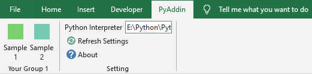

# PyAddin

VBA is not as popular as it used to be, while Excel is still widely used for holding, processing and reviewing data. Generally, an Excel file with macro (xlsm) is filled with data and embedded with complicated VBA scripts. The idea of this project is to split such Excel file into two separate parts: worksheets without macro (xlsx) as data container, and an Excel add-in (xlam) as computing engine.

`PyAddin` is a command-line tool facilitating the creation of Excel add-in (*.xlam), with ability to process data with Python.

- provides an Excel add-in template with customized Ribbon menu and a combination of VBA and Python. 
- helps to update the Ribbon UI during the development of your add-in.

The main idea is VBA macro calling Python script by console arguments, then retrieving return value stored in a temporary file as a bridge. In addition, leverage the ability of `pywin32`, all the interaction with Excel, e.g., reading/writing cell data, setting cell format, could be completed in Python script.


## Limitation

- Windows only
- Microsoft Excel 2007+
- Data transferring between VBA and Python is limited to simple **string** type
- What you can do with Excel depends on `pywin32/win32com`


## Installation

Install `PyAddin` from `Pypi` or local files:

```
# pypi
pip install pyaddin

# local  
python setup.py install

# local in development mode
python setup.py develop
```

Uninstall it with `pip`:

```
pip uninstall pyaddin
```

## Usage

```
> pyaddin -h

NAME
    pyaddin - Command line interface for ``PyAddin``.

SYNOPSIS
    pyaddin COMMAND | -

DESCRIPTION
    Command line interface for ``PyAddin``.

COMMANDS
    COMMAND is one of the following:

     init
       Create template project with specified name under current path.

     update
       Update add-in file (name.xlam) based on ribbon UI file (CustomUI.xml) under working path.
```

## Tutorial

### 1. Initialize template project

```
D:\WorkSpace>pyaddin init --name=sample
```

A template project consisted of the main add-in, as well as some dependent files, are created under current path.

```
sample\
|- scripts\
|    |- utils\
|    |    |- __init__.py
|    |    |- context.py
|    |- __init__.py
|    |- sample.py
|- main.cfg
|- main.py
|- CustomUI.xml
|- sample.xlam
```

- `main.py` is the interface for VBA function `RunPython()` to call.
- `main.cfg` is the configuration file with parameters like Python interpreter path.
- `scripts` is the default package for user defined Python scripts, e.g., `sample.py` is the first example.
- `CustomUI.xml` defines the Ribbon UI of this template add-in.
- `sample.xlam` is a template add-in, see screenshot below.





### 2. Customize Ribbon Tab

Check [`CustomUI.xml`](./pyaddin/resources/CustomUI.xml) created in Step 1, then define UI structures as needed. In this template case, two groups are defined: 

- `setting` group provides supporting features. It should be reused in your add-in.
- `Your Group 1` is an example for quick start, here two buttons are defined. Feel free to delete or modify it for your own purpose. 

For detailed information on Microsoft Ribbon UI, please refer to links below .

- [General Format of XML Markup Files](https://docs.microsoft.com/en-us/previous-versions/office/developer/office-2007/aa338202(v%3doffice.12)#general-format-of-xml-markup-files)
- [Custom UI](https://docs.microsoft.com/en-us/openspecs/office_standards/ms-customui/edc80b05-9169-4ff7-95ee-03af067f35b1)


After finishing your feature design in `CustomUI.xml`, run command below to apply to the add-in. Alternatively, you can do it by unzipping and updating the add-in file manually, or with other Custom UI editor.

```
D:\WorkSpace\sample>pyaddin update --name=sample
```


### 3. Implement Ribbon Control Actions

Actions defined in `CustomUI.xml` should be implemented in VBA module. For example, VBA macro `CB_Sample_1` is triggered accordingly when button `Sample 1` is clicked.

```xml
<button id="sample1" label="Sample 1" 
		imageMso="AppointmentColor3" size="large" 
		onAction="CB_Sample_1"
...>
```

Check the following sample codes from VBA module `UserRibbon` of `sample.xlam`. `RunPython` is a pre-defined VBA function to call Python scripts, and get return value. 

- The first argument is the path to python method, `package.module.method`. For example, "scripts.sample.run_example_1" refers to `run_example_1` from python script `sample/scripts/sample.py`.

- The second, third, ..., arguments refer to any count of parameters passing to python. Note that they **MUST** be simple type like string and number, and are converted to string type when passing to python with command line.

- The return value is `Dictionary` type with two keys:
  - `status`: True or False, indicates the status of calling python script.
  - `value`: the return value, or error message depends on `status`.


```vb
Sub CB_Sample_1(control As IRibbonControl)
    '''onAction for control: Sample 1'''
    Dim res As Object
    Dim x As Integer: x = Range("A1").Value
    Dim y As Integer: y = Range("A2").Value
    
    Set res = RunPython("scripts.sample.run_example_1", x, y)
    Range("A3") = res("value")    
End Sub

Sub CB_Sample_2(control As IRibbonControl)
    '''onAction for control: Sample 2'''
    RunPython "scripts.sample.run_example_2"
End Sub
```


### 4. Implement Python Script

Based on the calling from `RunPython`, create module file and implement associated methods.

```python
# sample.py
from .utils import context

def run_example_1(x:str, y:str):
    return int(x) + int(y)

def run_example_2():
    # get the workbook calling this method, then do anything with win32com
    wb = context.get_caller()
    sheet = wb.ActiveSheet

    # get cells value
    x = sheet.Range('A1').Value
    y = sheet.Range('A2').Value

    # set cell value
    sheet.Range('A3').Value = x + y
```

The two sample methods above did same thing: add values in cell `A1` and `A2`, then fill to cell `A3`, but in two different direction.

- `run_example_1` performs the pure computation with parameters received from VBA, then passes back to VBA for further processing, e.g., fill in `A3`. It applies for simle case with small amount of data.

- `run_example_2` does everything to the caller workbook directly, so parameter transferring is not necessary.

Comparing these two methods, the second reduces the coupling between VBA and python, but relies more on `pywin32`.


### 5. Test and Deliver the Add-in

Don't forget to set Python interpreter path (see `setting` group from the Ribbon UI) before running this add-in. 

Make sure deliver the entire project, rather than only the add-in itself, since they must work together. In addition, Python environment is required for the end user. If it's not available, an embedded portable python should be a good choice, so your add-in could be used out-of-box.


## License

MIT License